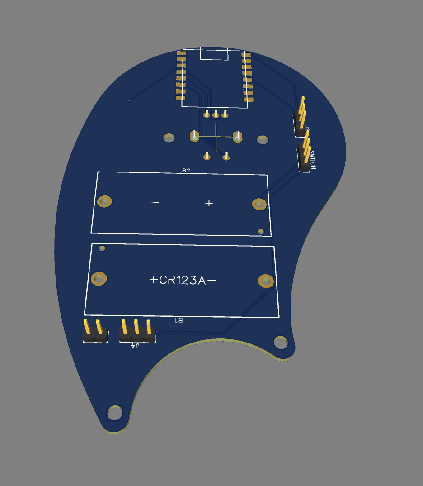
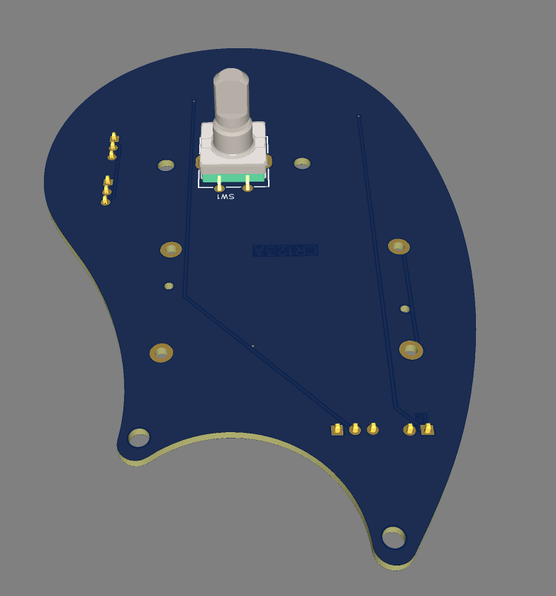

# Electronics

## BOM

- [ESP32 C3 Mini Dev Board](https://michiel.vanderwulp.be/domotica/Modules/ESP32-C3-SuperMini/)
- [EC11 Rotary Encoder](https://nl.aliexpress.com/item/1005005983134515.html?spm=a2g0o.productlist.main.1.a4cc37c83Cb6cO&algo_pvid=dab1d344-3dae-49fb-ae73-5fa2b2fbe406&algo_exp_id=dab1d344-3dae-49fb-ae73-5fa2b2fbe406-0&pdp_npi=4%40dis%21EUR%212.92%212.92%21%21%213.01%213.01%21%40211b812f17328732251698217e7bb8%2112000035172713577%21sea%21NL%21162207786%21X&curPageLogUid=8pbVyvYOEqu8&utparam-url=scene%3Asearch%7Cquery_from%3A)
- [Ws2812b](https://nl.aliexpress.com/item/1005006982206943.html?spm=a2g0o.productlist.main.1.6183135c8ddOg3&algo_pvid=51850496-99cd-4c2b-9559-2ebbc5af4890&algo_exp_id=51850496-99cd-4c2b-9559-2ebbc5af4890-0&pdp_npi=4%40dis%21EUR%213.90%211.64%21%21%2129.11%2112.23%21%4021038e1e17328733147107209e3c8f%2112000038933416726%21sea%21NL%21162207786%21X&curPageLogUid=TqEXwYRFevqM&utparam-url=scene%3Asearch%7Cquery_from%3A) Led ring 12 leds (Button)
- WS2812B Led ring 16 leds (Dial)
- [2X CR123A](https://nl.aliexpress.com/item/1005005883809271.html?spm=a2g0o.productlist.main.1.96f21881Opzm2b&algo_pvid=6a5a3c47-aefd-421d-b705-70ccebe1c391&algo_exp_id=6a5a3c47-aefd-421d-b705-70ccebe1c391-0&pdp_npi=4%40dis%21EUR%212.49%212.49%21%21%212.57%212.57%21%40211b81a317328743333334675e8be2%2112000034696162305%21sea%21NL%21162207786%21X&curPageLogUid=vR9BmacB3nCR&utparam-url=scene%3Asearch%7Cquery_from%3A) Battery holder

## Schematic

|  |
|-|
| Schematic |

## PCB

|  | |
|-|-|
| Bottom | Top |

