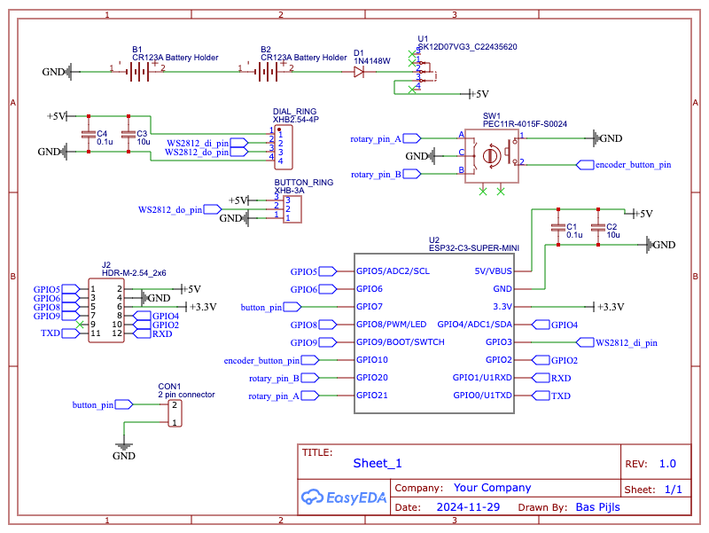
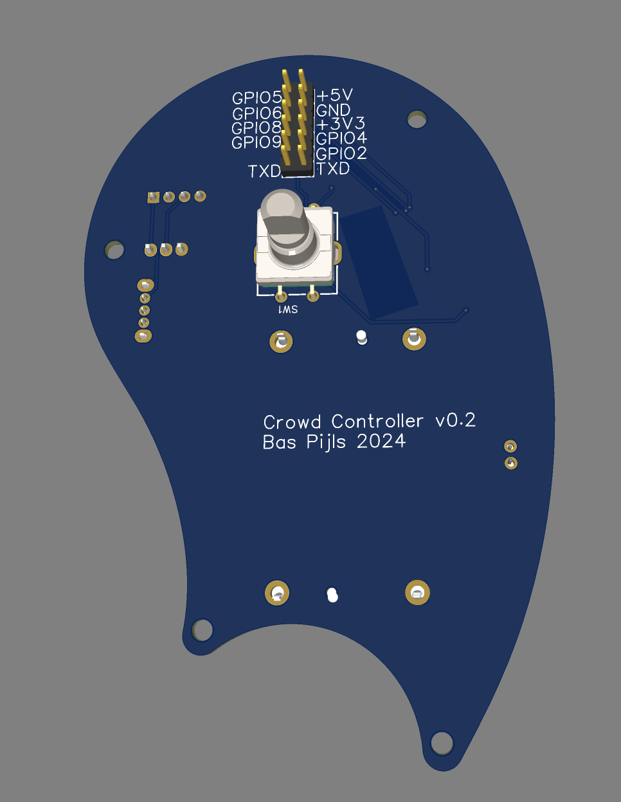
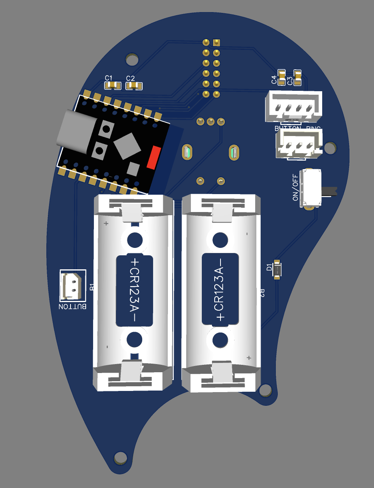
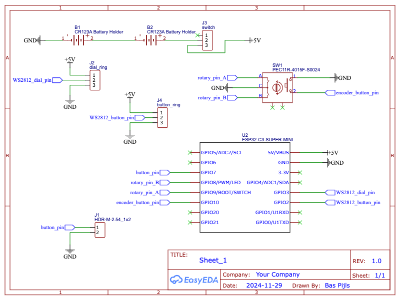

# Electronics

## BOM

- [ESP32 C3 Mini Dev Board](https://michiel.vanderwulp.be/domotica/Modules/ESP32-C3-SuperMini/)
- [EC11 Rotary Encoder](https://nl.aliexpress.com/item/1005005983134515.html?spm=a2g0o.productlist.main.1.a4cc37c83Cb6cO&algo_pvid=dab1d344-3dae-49fb-ae73-5fa2b2fbe406&algo_exp_id=dab1d344-3dae-49fb-ae73-5fa2b2fbe406-0&pdp_npi=4%40dis%21EUR%212.92%212.92%21%21%213.01%213.01%21%40211b812f17328732251698217e7bb8%2112000035172713577%21sea%21NL%21162207786%21X&curPageLogUid=8pbVyvYOEqu8&utparam-url=scene%3Asearch%7Cquery_from%3A)
- [Ws2812b](https://nl.aliexpress.com/item/1005006982206943.html?spm=a2g0o.productlist.main.1.6183135c8ddOg3&algo_pvid=51850496-99cd-4c2b-9559-2ebbc5af4890&algo_exp_id=51850496-99cd-4c2b-9559-2ebbc5af4890-0&pdp_npi=4%40dis%21EUR%213.90%211.64%21%21%2129.11%2112.23%21%4021038e1e17328733147107209e3c8f%2112000038933416726%21sea%21NL%21162207786%21X&curPageLogUid=TqEXwYRFevqM&utparam-url=scene%3Asearch%7Cquery_from%3A) Led ring 12 leds (Button)
- WS2812B Led ring 16 leds (Dial)
- [2X CR123A](https://nl.aliexpress.com/item/1005005883809271.html?spm=a2g0o.productlist.main.1.96f21881Opzm2b&algo_pvid=6a5a3c47-aefd-421d-b705-70ccebe1c391&algo_exp_id=6a5a3c47-aefd-421d-b705-70ccebe1c391-0&pdp_npi=4%40dis%21EUR%212.49%212.49%21%21%212.57%212.57%21%40211b81a317328743333334675e8be2%2112000034696162305%21sea%21NL%21162207786%21X&curPageLogUid=vR9BmacB3nCR&utparam-url=scene%3Asearch%7Cquery_from%3A) Battery holder
- JST Connectors (1x2pin, 1x3pin and 1x4pin)
- [Toggle switch](https://nl.aliexpress.com/w/wholesale-sk12d07vg3.html?spm=a2g0o.detail.search.0)
- 2x100nF capacitor (SMD 0805)
- 2x10uF capacitor (SMD 0805)
- 1x diode (SMD 0805)

??? note "LED Ring Sizes"

    LED with an equal number of LED's don't necessarily have the same diameter. Ultimately these LED-Rings were used:

    | [Button ring](https://www.otronic.nl/en/8-bit-rgb-leds-ws2812b-circle-round-neopixel.html)    |      |
    | -------------- | ---- |
    | LEDs           | 8    |
    | inner diameter | 18mm |
    | outer diameter | 32mm |

    | [Dial ring](https://www.otronic.nl/en/16-bit-rgb-leds-ws2812b-circle-round-neopixel.html)      |      |
    | -------------- | ---- |
    | LEDs           | 16    |
    | inner diameter | 54mm |
    | outer diameter | 70mm |

## Schematic

|  |
| ------------------------------------- |
| Schematic Version 1                   |

### Power

A diode is placed between the batteries and the `VCC` net in order to prevent current to flow back to the batteries when connected to the USB.

### LED Rings

The LED rings are now controlled by the ESP32 as one strip. The `DO` (**D**ata **O**ut) pin of the dial ring is connected to the `DI` (**D**ata **I**n) pin of the button ring. This will have less implications the timing in the firmware, as there is only one LED strip to manage.

### Pin numbers

The rotary encoder now uses pins 20 and 21.

### Decoupling

The ESP32 and the LED strip are now decoupled with a 100nF and a 10uF capacitor each to prevent voltage fluctuations.

### Unused pins

Unused pins are now broken out for future prototyping.

## PCB

|  |  |
| ----------------------------- | ----------------------------------- |
| Top                           | Bottom                              |

### Connectors

JST connectors are used instead of bare pins.

### ESP32 placement

The ESP32 is now placed above a bare patch so there is less ground plane interference. To keep it less close to the metal of the rotary encoder, the ESP32 is now placed more to the side.

### Switch

Instead of bare pins, the battery power is now switched by a [small switch](https://nl.aliexpress.com/w/wholesale-sk12d07vg3.html?spm=a2g0o.detail.search.0) at a 90 degree angle so the switch can be operated through a small hole at the side of the enclosure.

## Prototype

- Due to an error in the ESP32 part chosen for the schematic, `pin20` and pin21` where inadvertently chosen for the rotary encoder. These pins turned out to be `RX` and `TX` which are used for the serial port. Luckily pins 4 and 5 were broken out and situated very close to the rotary encoder on the PCB so this could easily be fixed in the prototype.
- Freshly charged Cr123 cells have a higher voltage than nominal so the total voltage of the power supply was >8v in some cases. This is too high for both the ESP32 and the WS2812. This was fixed by:
    - Connecting the cells in parallel. Now the total voltage is nominally 3.7v which is a little too low but workable.
    - Omitting the diode because the voltage drop of the diode would  get the voltage even lower.
- The pin-headers weren't situated conveniently enough for the enclosure. The pin header for the button-ledring should me moved closer to the button.
- The ESP32 might as well be on the top of the board as it does not take to much space and sometimes it needs to be reset after the PCB has been built into the enclosure.

### Improvements

#### High priority

- [ ] Place ESP32 on top
- [ ] Put power cells in parallel or place a voltage regulator between cells and `VCC`
- [ ] Use `pin4` and `pin5` for the rotary encoder.
- [ ] Break out `pin20` and `pin21` as `RXD` and `TXD`

#### Low priority

- [ ] Battery charging using the [XIAO ESP32](https://wiki.seeedstudio.com/XIAO_ESP32C3_Getting_Started/#battery-usage) instead of the ESP32-Supermini boards

??? note "Previous versions"

    === "Version 0"

        ## Schematic

        |  |
        | ------------------------------------- |
        | Schematic                             |

        ### Power

        Two 3.7v batteries are serially connected to yield a maximum of 7.4v. The voltage regulator on the ESP32C3-Mini board will turn it into 3.3v for the ESP32. The WS2812 will hopefully be able to operate at a higher voltage.

        ### LED Rings

        The two LED rings will each have a separate pin from the microcontroller.

        ## PCB

        |  |  |
        | ----------------------------- | ----------------------- |
        | Bottom                        | Top                     |

        ### Connectors

        The LED rings and the button will be connected using standard dupont cables. All connectors are situated at the bottom of the board.

        ### ESP32 placement

        The ESP32 will be placed with the USB connector pointing upwards.

        ### Switch

        The battery power can be turned on or off by shorting two pins.

        ## Prototype

        Reflecting on the prototype:

        - The Bluetooth antenna of the ESP32 board was right above the ground plane which greatly diminished the bluetooth range.
        - Unused pins weren't broken out so it was hard to add new features for prototyping.
        - Bare connectors tend to get loose. Better use JST connectors instead.
        - Using a jumper to switch on the device can't work if the device is inside an enclosure.
        - Two separate WS2812 strips might make it harder to manage timing in software

    === "Version 1"

        
