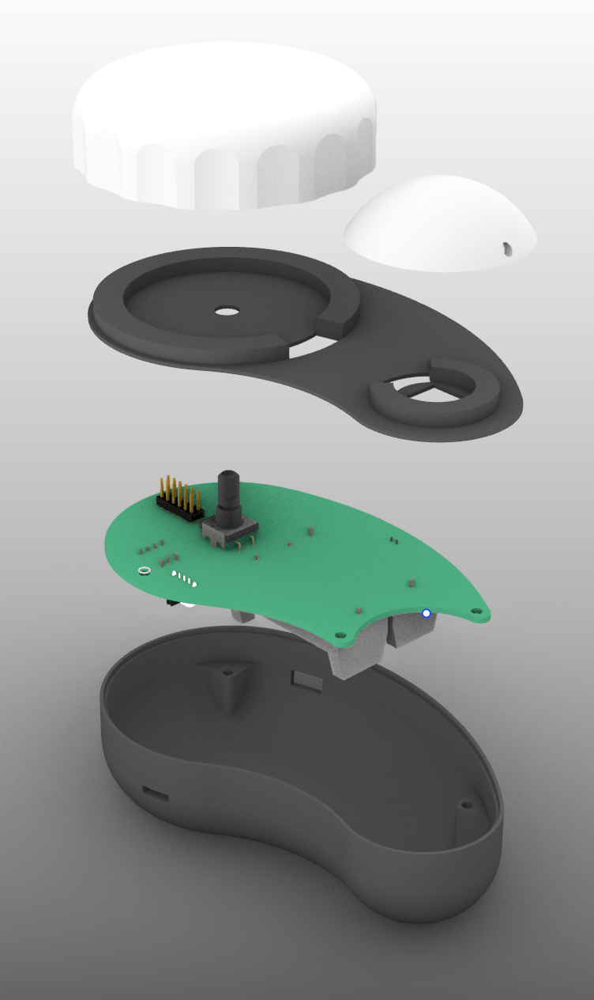
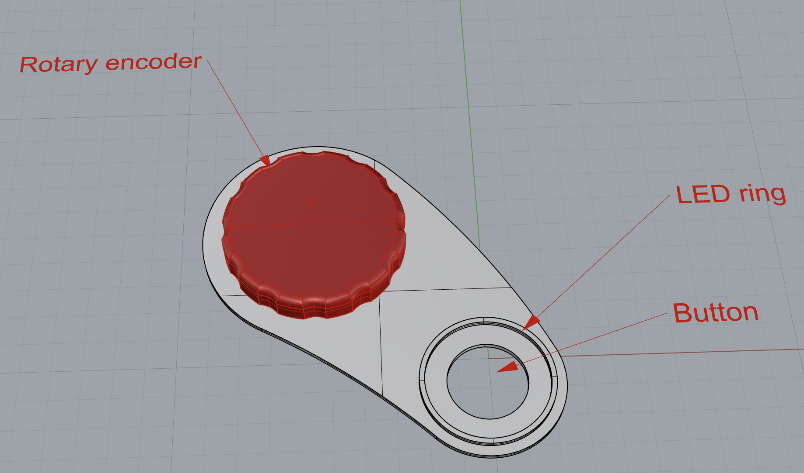
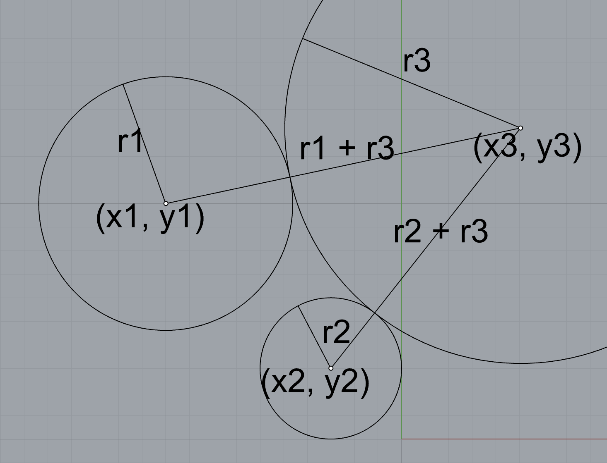
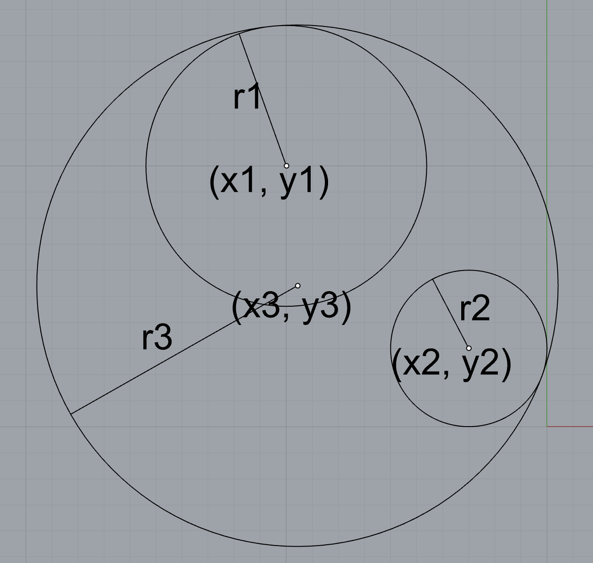

# Enclosure

A Crowd Controller device is meant to be held with one hand and operated by another. Therefore the device is shaped like a "droplet" by connecting two circles with a curved line. The top circle contains the rotary encoder and the bottom circle contains the button. The LEDs are placed in a ring around both circles.

||
|:--:|
| *Exploded view of the Crowd Controller enclosure* |

!!! note "Previous versions"

    === "Rhino3d Previsualisation"

        ||
        |:--:|
        | *Crowd Controller enclosure* |

    === "Openscad parametric design"
    
        ## Parametric design

        Openscad is used to create a parametric design. To create the curved droplet shape, the following parameters are used:

        - $r_1$: The radius of the circle 1
        - $r_2$: The radius of the circle 2
        - $r_3$: The radius of the upper curve
        - $(x_1, y_1)$: The center of circle 1
        - $(x_2, y_2)$: The center of circle 2

        If these parameters are given, there are only two possible locations for the center of a third circle, $(x_3, y_3)$ that describes the curve that tangentially connects the two circles. 

        ||
        |:--:|
        | *Finding the center of the third circle for the concave curve* |

        By recognizing that the distance of the center of the third circle must be the sum of $r_1$ and $r_3$ as well as the sum of $r_2$ and $r_3$, the center of the third circle can be found by finding the intersection of two circles:

        - Circle 1: 
        - position: $(x_1, y_1)$
        - $r: (r_1 + r_3)$
        - Circle 2: 
        - position: $(x_1, y_1)$
        - $r: (r_2 - r_3)$

        To find the **convex** curve that connects the two circles, instead of adding the radii, the radii are subtracted:

        - Circle 1: 
        - position: $(x_1, y_1)$
        - $r: (r_3 - r_1)$
        - Circle 2: 
        - position: $(x_2, y_2)$
        - $r: (r_3 - r_2)$

        
        ||
        |:--:|
        | *Finding the convex curve* |