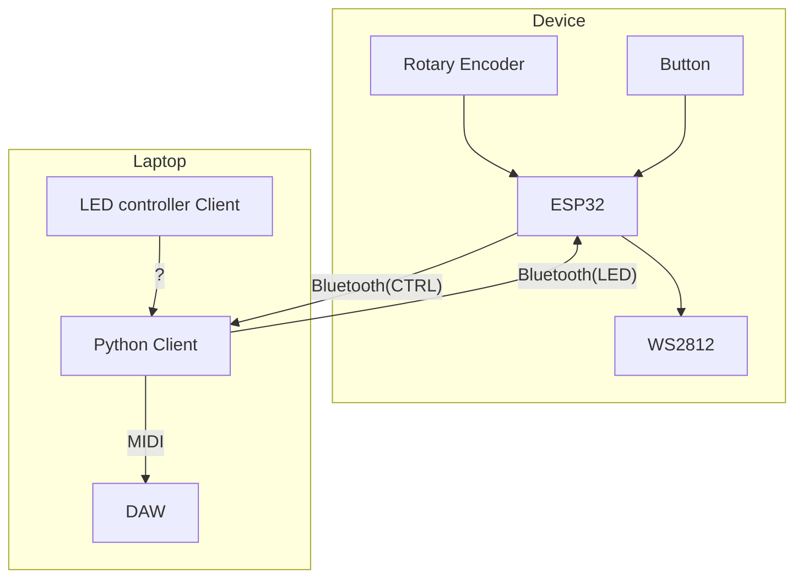

# Crowd Controller

> A distributed midi controller.

The Crowd Controller devices can be used to give a crowd of people the ability to control a single midi device. The devices are connected to a central computer via Bluetooth. The central computer runs a Python client that communicates with the devices and the Digital Audio Workstation (DAW).

Each device consists of a rotary encoder, a button, and a series WS2812 LEDs. The rotary encoder is used to change the value of a midi parameter, the button can be mapped to trigger notes or other midi messages, and the LEDs can be used to give feedback to the user.

