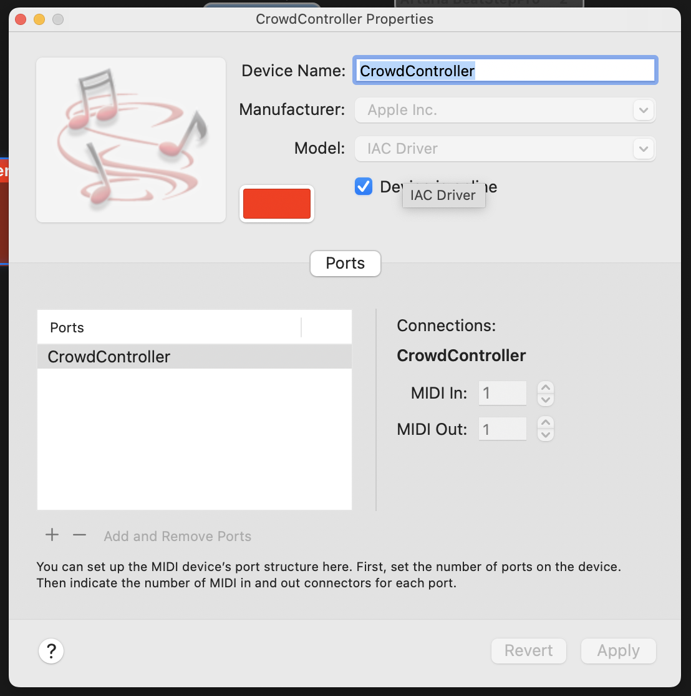

# Installation

## Create a virtual midi device

### MacOS

To create a virtual midi device on MacOS you can use the `IAC Driver`. To enable it, open the `Audio MIDI Setup` application and click on `Window` -> `Show MIDI Studio`. Then double-click on the `IAC Driver`.

-  check the `Device is online` checkbox.
-  name the device `Crowd Controller`.
-  click on the `+` button to add a new port and name it `Crowd Controller`.

||
|-|
|*MacOS MIDI setup*|


### Windows

To create a virtual midi device on Windows you can use the `loopMIDI` application. Download and install the application from [Tobias Erichsen](https://www.tobias-erichsen.de/software/loopmidi.html). Open the application and click on the `+` button to add a new port and name it `Crowd Controller`.

!!! warning "Windows"
    The `loopMIDI` application was not tested.

## Python client

To use the python library you need to install some libraries, preferably in a virtual environment. `cd` into the `crowd-controller/python-client` directory:

```bash
cd python-client
```

and run the following commands:

```bash
python3 -m venv venv
source venv/bin/activate
pip install -r requirements.txt
```

Then you can run the client with:

```bash
python3 crowd-control-client.py
```

!!! tip "Testing the midi device"

    You can test the midi-device in your DAW by running:

    ```bash
    python3 mido-test.py
    ```

    from the `python-client` directory. Some VCV Rack patches are included in the `vcv` directory to test the midi device but you can use any DAW.

## ESP32C3

To program the ESP32C3 you need to install the Arduino IDE and the ESP32 board support. Follow the instructions on the [Espressif website](https://docs.espressif.com/projects/arduino-esp32/en/latest/installing.html) to install the boards.


### Libraries

The following libraries are used in the ESP32 code:

- [NeoPixel](https://www.adafruit.com/category/168)
- [rotary-encoder](https://www.mathertel.de/Arduino/RotaryEncoderLibrary.aspx)