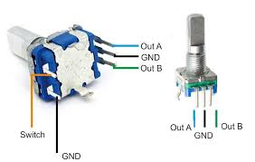

# Software

A single crowd controller device consists of:

- a rotary encoder
- a button
- a series of WS2812 LEDs
- an ESP32 microcontroller

## Rotary encoder

||
|--|
| *Rotary encoder connections* |

- No pull-up resistors are needed because the ESP32 has internal pull-up resistors.

Read the encoder by hand:

```cpp
void IRAM_ATTR updateRotary() {
  int MSB = digitalRead(ROTARY_PIN_A);
  int LSB = digitalRead(ROTARY_PIN_B);

  int encoded = (MSB << 1) | LSB;
  int sum = (lastEncoded << 2) | encoded;

  if (sum == 0b1101 || sum == 0b0100 || sum == 0b0010 || sum == 0b1011)
    rotaryPosition++;
  if (sum == 0b1110 || sum == 0b0111 || sum == 0b0001 || sum == 0b1000)
    rotaryPosition--;

  lastEncoded = encoded;
}
```

attached to the interrupt in the setup function:

```cpp
pinMode(ROTARY_PIN_A, INPUT_PULLUP);
pinMode(ROTARY_PIN_B, INPUT_PULLUP);

// Attach interrupts for rotary encoder
attachInterrupt(digitalPinToInterrupt(ROTARY_PIN_A), updateRotary, CHANGE);
attachInterrupt(digitalPinToInterrupt(ROTARY_PIN_B), updateRotary, CHANGE);
```

or use a [library](https://www.mathertel.de/Arduino/RotaryEncoderLibrary.aspx).

## Bluetooth communication

- Python library [bleak](https://github.com/hbldh/bleak)
- 
### Services and characteristics

The ESP32 is set up as a BLE server with one service and three characteristics:

```python
SERVICE_UUID = "3796c365-5633-4744-bc65-cac7812ef6da"
BUTTON_CHARACTERISTIC_UUID = "640033f1-08e8-429c-bd45-49ed4a60114e"
ROTARY_CHARACTERISTIC_UUID = "2a9ceeec-2d26-4520-bffe-8b13f00d4044"
WS2813_CHARACTERISTIC_UUID = "dcfd575f-b5d4-42c2-bf57-c5141fe2eaa9"
```

!!! note "Service vs characteristic"
    A service is a collection of characteristics. A characteristic is a value that can be read, written, or notified.
    
!!! warning "Notifications did not work"
    
    When using the `bleak` library, notifications did not work. The ESP32 would send the notification, but the Python client would not receive it. The error received was:

    ```
    bleak.exc.BleakError: Notification was not acknowledged.
    ```

    and later:

    ```
    bleak.exc.BleakError: Failed to update the notification status for characteristic 41: Error Domain=CBATTErrorDomain Code=10 "The attribute could not be found." UserInfo={NSLocalizedDescription=The attribute could not be found.}
    ```

    A workaround was to poll the ESP32 for the value of the characteristic in an infinite, asynchronous loop.